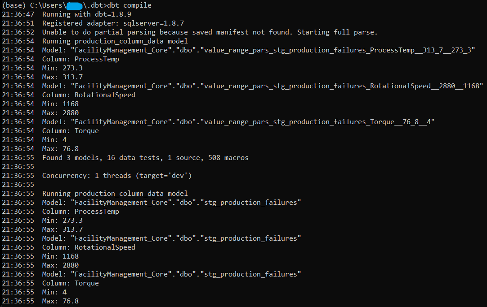
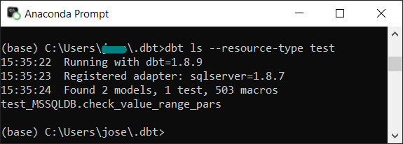
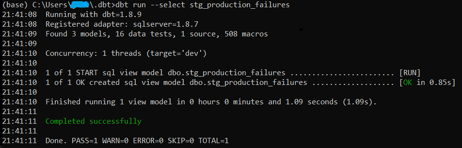
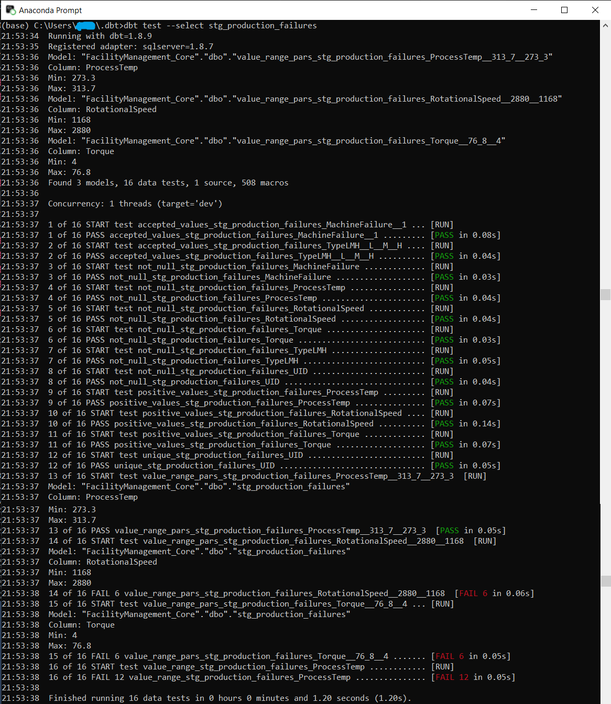
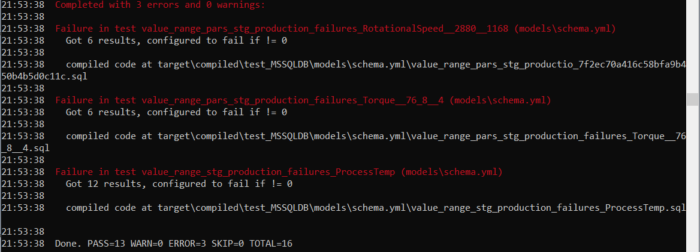
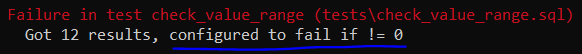
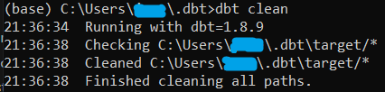
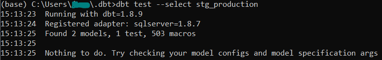
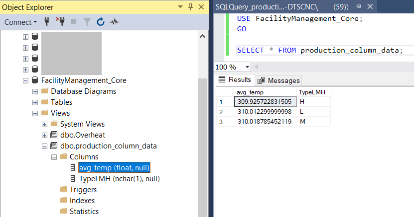

# dbt applications

-------------------------------------

I recommend 

1. starting with a basic setup, a starter kit, in which I explain all dependencies that are required to set up a basic, but functional system. This one.

[dbt starter kit](../MSSQL_dbt_starterpack)

2. This one as an advanced staging and testing setup (on the same dataset as this one).

Both examples are based on a local MS SQL server, with prepared Factory dataset (from Kaggle).

dbt is running in Python runtime environment and uses JINJA2 dynamic referencing giving high variability to the static SQL queries. See some DML, DDL and test-query examples in [SQL snippets](../SQL_snippets) folder.

Dive into the details, understand it, especially the naming (referencing) restrictions, then move to the next level.

-----------------------------------

Detailed information can be found in the description (readme) of the starter kit.

## MS SQL server and dbt

### Setting up the server and database

I downloaded a **Machine in Production data** [csv file](https://www.kaggle.com/datasets/shivamb/machine-predictive-maintenance-classification) from Kaggle including Production data, which I uploaded to my local MS SQL server, FacilityManagement_Core database, Production1 table.

1. The MS SQL server 2022 instance was installed and set up earlier, knowing OLE DB driver and other key information (see starter kit readme).

2. Launched the dbt on the MS SQL server (see starter kit readme).


## 1. Starter dbt system
Copy (or Git Clone) this project to a local folder. The root folder contains a main folder **MSSQL_dbt_starterpack**, with a very basic system just to check **dbt (core) - MS SQL** co-operation / functionality and to start understanding ```dbt (core)``` from the basics.

Create a specific folder for dbt project (like C:/.dbt) and copy the subfolder content of the **MSSQL_dbt_starterpack** folder to the above created folder, so that folder structure should look like:

```
.dbt
# |-- dbt_project.yml
# |-- profiles.yml
# |-- test
# |   |-- generic
# |   |    └── test_positive_values.sql
# |   |-- check_value_range.sql
# |   |-- check_value_range_pars.sql
# |
# |-- models
#     |-- staging
#     |   |-- stg_production.sql
#     |   |-- stg_event_sessions.sql
#     |
#     |-- production1.sql
#     |-- schema.yml
```

The advanced dbt example has similar folder structure.

## 2. System with elevated dbt functionality
Copy (or Git Clone) the whole project to a local folder. The root folder contains a main folder **MSSQL_dbt_elevated**, with a very basic system just to check **dbt (core) - MS SQL** co-operation / functionality and to start understanding ```dbt (core)``` from the basics.

Create a specific folder for dbt project (like C:/.dbt) and copy the subfolder content of the **MSSQL_dbt_elevated** folder to the above created folder, so that folder structure should look similar to the above defined structure with some additional folders (e.g. macros, log) and files.

## 3. Configure, and validate configuration
Check eand modify the ```profiles.yml``` configuration file, which resembles to this (Windows authentication, no encryption defined):

```
a_profile_name:				# chose some descriptive, but short name
  target: dev				# this is the selector of below defined target environment to run
  outputs:
    dev:					# Development environment
      type: sqlserver
      driver: 'ODBC Driver 17 for SQL Server' # (The ODBC Driver installed on your system)
      server: hostname or IP of your server
      port: 1433			#default port, check your SQL server connection config!
      database: databasename #database name on the SQL server
      schema: schema_name	# odb if Schema is not specified
      user: username		# authentication user name
      password: password	# authentication user password
```

When ```profiles.yml``` is correctly filled in with appropriate information,  
move into the ```.dbt``` folder in the python shell (command window with active Python environment), then run 

### Staging: select machine failure entries (for View)

1. ```dbt compile``` in python shell.



dbt compiles the pre-defined folder structure with the pre-defined sql queries.

Run one of these commands to check function:

2. ```dbt list --resource-type test``` - check whether pre-configured test has been compiled



Result should include:

```test_MSSQLDB.check_value_range_stg_production_ProcessTemp```

in general: ```ModelName.sqltestmodelname_stagingsqlname_DatabaseColumnName```
3. ```dbt run --select stg_production_failures```  - pre-run the models, create the views/tables



Check the MS SQL database for newly created data tables/views!
4. ```dbt test --select stg_production_failures``` - run a specific test **stg_production** declared in ```schema.yml```



and 



This latter one indicates errors and failures.

Note: failure of the test condition can appear as 'error', however it ay not be a runtime error (so the code is fine, just the warning/error level was set to define failure as 'error').



When the compilation and run(s) success then the predefined 'stg_production_failures' View is created in the MS SQL database. Verify with SQL query that the table contains all rows with MachineFailure = 1! This way the data related to failure situation may be further analysed using the filtered view (instead of the whole dataset), thus resulting in faster data processing.


It is possible to run a full system test (inluding both predefined ```stg_production_failure``` and ```production_column_data``` models):
5. ```dbt test``` - in this example the full test is the same as in the 3rd point (being the model extremely simple, with 1 test only)

If you run into compilation or run error, then try:

```dbt clean```



... then find and fix the issue and start compiling and running again the project.

If you receive 'Nothing to do...' response on running ```dbt test... ```



It should not happen with this model, but if you modify some parts ... then check the models definitions in schema.yml, especially check for the rigorous match of the model name with a connected modelname.sql file in the models folder!

### Create calculation based table/View

run the following command to get average ProcessTemp (machining process temperature) values separately for L (low), M (medium), and H (high) quality products.

``` dbt test --select production_column_data```

Check the resulting View in MS SQL database:



_________________________________________________

## Additional dbt information

For additional information go back to [dbt project root](../).