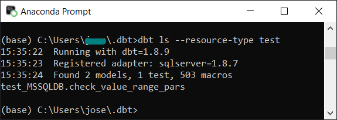

# dbt applications

-------------------------------------

I found this database wrangling/managing tool online and found it quite impressive immediately 'at first sight'. Here you find some application 

1. starting with a basic setup, a starter kit, in which I explain all dependencies that are required to set up a basic, but functional system. This one.

2. an advanced staging and testing setup (on the same dataset as this one).
[dbt advanced kit](../../MSSQL_dbt_elevated)

Both examples are based on a local MS SQL server, with prepared Factory dataset (from Kaggle).

dbt is running in Python runtime environment and uses JINJA2 dynamic referencing giving high variability to the static SQL queries. See some DML, DDL and test-query examples in [SQL snippets](../../SQL_snippets) folder.

I recommend starting with this one first, dive in, understand it, especially the naming (referencing) restrictions, then move to the next level.

-----------------------------------

## MS SQL server and dbt

### Setting up the server and database

I downloaded a **Machine in Production data** [csv file](https://www.kaggle.com/datasets/shivamb/machine-predictive-maintenance-classification) from Kaggle including Production data, which I uploaded to my local MS SQL server, FacilityManagement_Core database, Production1 table.

The MS SQL server 2022 instance was installed and set up earlier [MS download page](https://www.microsoft.com/en-us/sql-server/sql-server-downloads). Authentication was set to Microsoft User Authentication (to keep it simple).

An important information is the OLE DB Connector (ODBC) driver version, that is required for proper configuration of the dbt system. The (driver)[Download Microsoft ODBC Driver 18 for SQL Server (x64)](https://go.microsoft.com/fwlink/?linkid=2280794)
 name should be checked in the (installed) 
 
 
 
It should be ```'ODBC Driver 17 for SQL Server'``` or ...18... (on Windows OS). dbt 1.8+ version is compatible with both driver versions. 
 
The entire name should be copied and used... see later.
 

### Launching dbt on the MS SQL server

Follow the instructions here: 
[MSSQL-dbt setup](https://docs.getdbt.com/docs/core/connect-data-platform/mssql-setup)

After installing the dbt-core and dbt-sqlserver modules you have to chose from:
1. Authentication:
- SQL server / Windows credentials / Microsoft ENTRA ID
2. Encryption
- with (requires enabling https connection for the MS SQL server) / without (for local use only, not secure!)

See advised configuration parameters and config file at the **Common configuration** section of the MSSQL-dbt setup page (see link above).

#### 1. Starter dbt system
Copy (or Git Clone) this project to a local folder. The root folder contains a main folder **MSSQL_dbt_starterpack**, with a very basic system just to check **dbt (core) - MS SQL** co-operation / functionality and to start understanding ```dbt (core)``` from the basics.

Create a specific folder for dbt project (like C:/.dbt) and copy the subfolder content of the **MSSQL_dbt_starterpack** folder to the above created folder, so that folder structure should look like:

```
.dbt
# |-- dbt_project.yml
# |-- profiles.yml
# |-- test
# |   |-- generic
# |   |    └── test_positive_values.sql
# |   |-- check_value_range.sql
# |   |-- check_value_range_pars.sql
# |
# |-- models
#     |-- staging
#     |   |-- stg_production.sql
#     |   |-- stg_event_sessions.sql
#     |
#     |-- production1.sql
#     |-- schema.yml
```

#### 2. System with elevated dbt functionality
Copy (or Git Clone) this project to a local folder. The root folder contains a main folder **MSSQL_dbt_elevated**, with a very basic system just to check **dbt (core) - MS SQL** co-operation / functionality and to start understanding ```dbt (core)``` from the basics.

Create a specific folder for dbt project (like C:/.dbt) and copy the subfolder content of the **MSSQL_dbt_elevated** folder to the above created folder, so that folder structure should look similar to the above defined structure with some additional folders (e.g. macros, log) and files.

#### 3. Configure, and validate configuration
Check eand modify the ```profiles.yml``` configuration file, which resembles to this (Windows authentication, no encryption defined):

```
a_profile_name:				# chose some descriptive, but short name
  target: dev				# this is the selector of below defined target environment to run
  outputs:
    dev:					# Development environment
      type: sqlserver
      driver: 'ODBC Driver 17 for SQL Server' # (The ODBC Driver installed on your system)
      server: hostname or IP of your server
      port: 1433			#default port, check your SQL server connection config!
      database: databasename #database name on the SQL server
      schema: schema_name	# odb if Schema is not specified
      user: username		# authentication user name
      password: password	# authentication user password
```

When ```profiles.yml``` is correctly filled in with appropriate information,  
move into the ```.dbt``` folder in the python shell (command window with active Python environment), then run 

1. ```dbt compile``` in python shell.

dbt compiles the pre-defined folder structure with the pre-defined sql queries.

Run one of these commands to check function:

2. ```dbt list --resource-type test``` - check whether pre-configured test has been compiled

Result should include:

```test_MSSQLDB.check_value_range_stg_production_ProcessTemp```



in general: ```ModelName.sqltestmodelname_stagingsqlname_DatabaseColumnName```
3. ```dbt run --select stg_production```  - pre-run the models, create the views/tables

Check the MS SQL database for newly created data tables/views!
4. ```dbt test --select stg_production``` - run a specific test **stg_production** declared in ```schema.yml```

or run a full system test:
5. ```dbt test``` - in this example the full test is the same as in the 3rd point (being the model extremely simple, with 1 test only)

If you run into compilation or run error, then try:

```dbt clean```

... then find and fix the issue and start compiling and running again the project.


Note: failure of the test condition can appear as 'error', however it ay not be a runtime error (so the code is fine, just the warning/error level was set to define failure as 'error').


_________________________________________________

## Additional dbt information

For additional information go back to [dbt project root](../).
